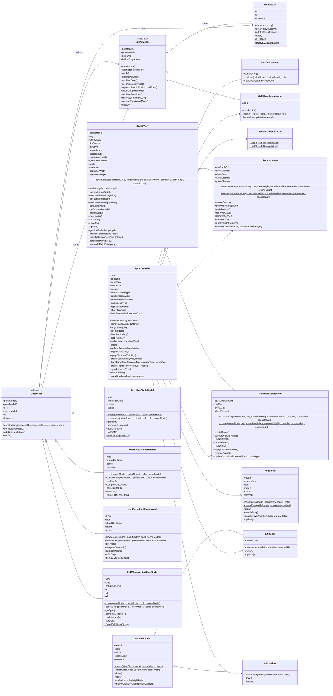

```mermaid
classDiagram
direction LR

class AppController {
  +svg
  +container
  +activeTool
  +tempPoint
  +scenes
  +currentSceneType
  +currentSceneView
  +secondarySceneView
  +rightSceneType
  +rightSceneModel
  +showDiscAxes
  +handleOutsideLineActionClick
  +constructor(svg, container)
  +removeLineActionButtons()
  +init(sceneType)
  +setTool(tool)
  +handleClick(x, y)
  +addPoint(x, y)
  +makeLineActions(lineView)
  +clear()
  +setDiscAxesVisible(visible)
  +toggleDiscAxes()
  +applyDiscAxesVisibility()
  +createSceneView(type, model)
  +transformModel(sourceModel, sourceType, targetType)
  +createRightSceneView(type, model)
  +syncTo(sceneType)
  +switchSides()
  +drawLine(lineModel, sceneView)
}

class GeometryTransformer {
  +DiscToHalfPlane(pointDisc)$
  +HalfPlaneToDisc(pointHalf)$
}

class SceneView {
  +sceneModel
  +svg
  +pointViews
  +lineViews
  +isActive
  +sceneIndex
  +sceneCount
  +_containerHeight
  +_containerWidth
  +scale
  +controller
  +constructor(sceneModel, svg, containerHeight, containerWidth, controller, sceneIndex, sceneCount)
  +scaleLength(modelLength)
  +containerWidth
  +containerHeight
  +get containerWidth()
  +set containerWidth(value)
  +get containerHeight()
  +set containerHeight(value)
  +getSceneWidth()
  +getSceneXBounds()
  +createScene()
  +deactivate()
  +renderAll()
  +clearAll()
  +update()
  +getLineEndpoints(p1, p2)
  +mathToScreen(pointModel)
  +mathToScreenPoint(pointModel)
  +screenToMath(px, py)
  +screenToMathPoint(px, py)
}

class DiscSceneView {
  +unitCircleClip
  +circleElement
  +showAxes
  +xAxisElement
  +yAxisElement
  +constructor(sceneModel, svg, containerHeight, containerWidth, controller, sceneIndex, sceneCount)
  +create(sceneModel, svg, containerHeight, containerWidth, controller, sceneIndex, sceneCount)$
  +createScene()
  +setAxesVisible(visible)
  +updateAxes()
  +removeAxes()
  +removeScene()
  +updateClip()
  +applyClipToElements()
  +updateContainerSize(newWidth, newHeight)
}

class HalfPlaneSceneView {
  +baseLineElement
  +clipRect
  +showAxes
  +yAxisElement
  +constructor(sceneModel, svg, containerHeight, containerWidth, controller, sceneIndex, sceneCount)
  +create(sceneModel, svg, containerHeight, containerWidth, controller, sceneIndex, sceneCount)$
  +createScene()
  +setAxesVisible(visible)
  +updateAxes()
  +removeAxes()
  +updateClip()
  +applyClipToElements()
  +removeScene()
  +updateContainerSize(newWidth, newHeight)
}

class GeodesicView {
  +model
  +color
  +width
  +sceneView
  +element
  +create(ViewClass, model, sceneView, options)$
  +constructor(model, sceneView, color, width)
  +draw()
  +update()
  +enableHover(highlightColor)
  +enableClickMenu(addButtonCallback)
}

class PointView {
  +model
  +sceneView
  +svg
  +radius
  +color
  +element
  +constructor(model, sceneView, radius, color)
  +createDraggable(model, sceneView, options)$
  +draw()
  +enableDrag()
  +enableHover(highlightColor, normalColor)
  +update()
}

class LineView {
  +currentType
  +constructor(model, sceneView, color, width)
  +draw()
  +update()
}

class CircleView {
  +constructor(model, sceneView, color, width)
  +draw()
  +update()
}

class PointModel {
  +x
  +y
  +listeners
  +constructor(x, y)
  +setXY(newX, newY)
  +addListener(listener)
  +notify()
  +toJSON()$
  +fromJSON(jsonString)$
}

class LineModel {
  <<abstract>>
  +pointModel1
  +pointModel2
  +color
  +sceneModel
  +id
  +listeners
  +constructor(pointModel1, pointModel2, color, sceneModel)
  +computeGeodesic()
  +addListener(listener)
  +notify()
}

class SceneModel {
  <<abstract>>
  +lineModels
  +pointModels
  +listeners
  +isLineDragActive
  +constructor()
  +addListener(listener)
  +notify()
  +beginLineDrag()
  +endLineDrag()
  +reconcileLineTypes()
  +replaceLine(oldModel, newModel)
  +addPoint(pointModel)
  +addLine(lineModel)
  +removeLine(lineModel)
  +removePoint(pointModel)
  +clearAll()
}

class DiscSceneModel {
  +constructor()
  +addLine(pointModel1, pointModel2, color)
  +handleLineUpdate(lineModel)
}

class HalfPlaneSceneModel {
  +EPS
  +constructor()
  +addLine(pointModel1, pointModel2, color)
  +handleLineUpdate(lineModel)
}

class DiscLineCircleModel {
  +create(pointModel1, pointModel2, color, sceneModel)$
  +type
  +shouldBeCircle
  +center
  +radius
  +constructor(pointModel1, pointModel2, color, sceneModel)
  +getType()
  +computeGeodesic()
  +addListener(fn)
  +toJSON()
  +fromJSON(jsonString)$
}

class DiscLineDiameterModel {
  +create(pointModel1, pointModel2, color, sceneModel)$
  +type
  +shouldBeCircle
  +center
  +direction
  +constructor(pointModel1, pointModel2, color, sceneModel)
  +getType()
  +computeGeodesic()
  +addListener(fn)
  +toJSON()
  +fromJSON(jsonString)$
}

class HalfPlaneSemiCircleModel {
  +EPS
  +create(pointModel1, pointModel2, color, sceneModel)$
  +type
  +shouldBeCircle
  +center
  +radius
  +constructor(pointModel1, pointModel2, color, sceneModel)
  +getType()
  +computeGeodesic()
  +addListener(fn)
  +toJSON()
  +fromJSON(jsonString)$
}

class HalfPlaneVerticalLineModel {
  +EPS
  +create(pointModel1, pointModel2, color, sceneModel)$
  +type
  +shouldBeCircle
  +x
  +x1
  +x2
  +constructor(pointModel1, pointModel2, color, sceneModel)
  +getType()
  +computeGeodesic()
  +addListener(fn)
  +toJSON()
  +fromJSON(jsonString)$
}

SceneModel <|-- DiscSceneModel
SceneModel <|-- HalfPlaneSceneModel

LineModel <|-- DiscLineCircleModel
LineModel <|-- DiscLineDiameterModel
LineModel <|-- HalfPlaneSemiCircleModel
LineModel <|-- HalfPlaneVerticalLineModel

SceneView <|-- DiscSceneView
SceneView <|-- HalfPlaneSceneView

GeodesicView <|-- LineView
GeodesicView <|-- CircleView

SceneModel "1" o-- "*" PointModel : stores
SceneModel "1" o-- "*" LineModel : stores
LineModel "1" --> "2" PointModel : uses
LineModel --> SceneModel : updates

AppController --> GeometryTransformer
AppController --> DiscSceneModel
AppController --> HalfPlaneSceneModel
AppController --> DiscSceneView
AppController --> HalfPlaneSceneView
AppController --> PointView
AppController --> LineView
AppController --> CircleView
```